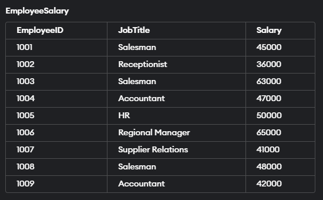

 Data Analyst Bootcamp Playlist: https://bit.ly/3HHqwcr

 RESOURCES:

Coursera Courses:
* 📖Google Data Analyst Certification: https://coursera.pxf.io/5bBd62
* 📖Data Analysis with Python - https://coursera.pxf.io/BXY3Wy
* 📖IBM Data Analysis Specialization - https://coursera.pxf.io/AoYOdR
* 📖Tableau Data Visualization - https://coursera.pxf.io/MXYqaN

Udemy Courses:
* 📖Python for Data Science - https://bit.ly/3Z4A5K6
* 📖Statistics for Data Science - https://bit.ly/37jqDbq
* 📖SQL for Data Analysts (SSMS) - https://bit.ly/3fkqEij
* 📖Tableau A-Z - http://bit.ly/385lYvN

